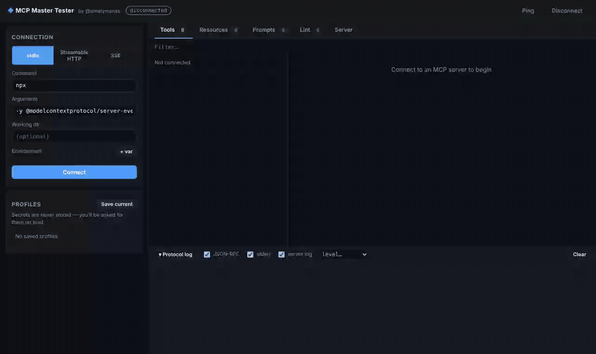

# MCP Master Tester

[](https://www.npmjs.com/package/mcp-master-tester)
[](https://github.com/simplymanas/mcp-master-tester/actions/workflows/ci.yml)
[](LICENSE)
[](https://nodejs.org)
[](CONTRIBUTING.md)
[](https://github.com/simplymanas/mcp-master-tester/stargazers)

**A local web UI to connect to, inspect and test any [Model Context Protocol](https://modelcontextprotocol.io) server.**

You point it at a server, either a local command over stdio or a remote URL over Streamable HTTP or SSE. It lists the server's tools, resources and prompts and gives each one a form, so you can call it and see exactly what comes back, down to every JSON-RPC message.

> 🤝 **Open source and looking for collaborators.** Whether you build MCP servers, love clean UIs, or just found a bug, see [Contributing](#contributing). First-time contributors are welcome.

```bash
npx mcp-master-tester
```



---

## Features

- **Every transport:** stdio, Streamable HTTP and SSE. The Node backend proxies all traffic, so remote servers don't hit browser CORS limits.
- **Keys and auth:**
  - Environment variables for stdio servers. Headers or a Bearer token for remote ones.
  - Keys named like `*KEY*`, `*TOKEN*`, `*SECRET*` or `*PASSWORD*` are hidden automatically.
  - If a remote server answers **401**, the app prompts for a token and retries.
  - If a stdio server crashes and its error output mentions a missing key, the app offers to add it as an env var and reconnect.
- **Tool forms from the schema:** each tool's `inputSchema` becomes a form, with fields for each type:
  - strings, numbers and integers
  - booleans
  - enums, including `oneOf` / `const` with titles
  - multi-select arrays
  - JSON editors for objects
  - required-field checks before anything is sent, plus an *Edit as JSON* mode
- **Running tools:** set a timeout per call. Progress shows live from `notifications/progress`. Tools marked destructive ask for confirmation, and each tool keeps a call history.
- **Result viewer:** shows the result in readable form:
  - text (JSON is pretty-printed), images, audio, resource links and embedded resources
  - `structuredContent`
  - an `isError` tool result shown separately from a protocol error
  - how long the call took
- **Resources:** static resources and URI templates (fill in the variables, then read). Both text and blob contents display.
- **Prompts:** fill in the arguments and see the messages the prompt returns.
- **Elicitation:** if a server sends `elicitation/create` to ask the user for input, a form built from its `requestedSchema` appears. URL-mode requests are supported too.
- **Lint:** static checks of each tool definition against the spec and good practice:
  - `inputSchema` and `outputSchema` must be of type object
  - required fields must be defined
  - flags missing types and descriptions
  - checks name format and duplicates
  - flags missing annotations
- **Protocol log:** shows traffic and server output, newest at the bottom:
  - every JSON-RPC frame in both directions, with request → response time
  - the server's stderr
  - `notifications/message` log entries
  - a `logging/setLevel` control
- **Profiles:** saved in your browser. Secrets are never stored, so the app asks for them when you connect.
- **No build step:** Express on the backend and plain JavaScript in the browser. Light and dark themes follow your system setting.

## Quick start

```bash
npx mcp-master-tester
```

Or run from source:

```bash
git clone https://github.com/simplymanas/mcp-master-tester.git
cd mcp-master-tester
npm install
npm start
```

Open **http://127.0.0.1:6280** and click **Connect**. The default fields launch the reference server (`npx -y @modelcontextprotocol/server-everything`), which uses every feature above.

Requires **Node.js 20+**. To use a different port, set `PORT`, for example `PORT=7000 npx mcp-master-tester`.

## Connecting to servers

| Server type | Settings |
|---|---|
| Local npm package | stdio → Command `npx`, Arguments `-y @modelcontextprotocol/server-filesystem /path/to/dir` |
| Local script | stdio → Command `python`, Arguments `my_server.py`, Working dir as needed |
| Needs an API key | stdio → **+ var** → `GITHUB_PERSONAL_ACCESS_TOKEN` = `…` (hidden automatically) |
| Remote (current spec) | Streamable HTTP → URL `https://host/mcp`, plus a Bearer token if required |
| Remote (legacy) | SSE → URL `https://host/sse` |

Shortcut: <kbd>Ctrl</kbd>/<kbd>⌘</kbd> + <kbd>Enter</kbd> runs the selected tool, prompt or resource.

## How it works

```
Browser UI ──REST──▶ Express backend ──MCP──▶ your server (stdio | Streamable HTTP | SSE)
           ◀──SSE───  (one MCP Client per session; streams RPC frames, stderr, logs, elicitations)
```

| File | Responsibility |
|---|---|
| `server.js` | Session lifecycle, transports, JSON-RPC tap, elicitation bridge, REST API |
| `public/app.js` | Connection form, schema forms, result rendering, lint, protocol log |
| `public/style.css` | Theme tokens (light/dark) and layout |
| `public/index.html` | Page shell |
| `test/api.test.js` | Integration tests against the reference server (`npm test`) |

### REST API

All calls are `POST` with a JSON body. The reply is `{ ok, ms, result }`, or on failure `{ ok: false, error, code, data, authRequired }`.

| Endpoint | MCP method |
|---|---|
| `/api/sessions` | connect (`initialize`) |
| `DELETE /api/sessions/:id` | close |
| `GET /api/sessions/:id/events` | event stream (SSE) |
| `/api/sessions/:id/ping` | `ping` |
| `/api/sessions/:id/tools/list` · `tools/call` | `tools/*` |
| `/api/sessions/:id/resources/list` · `resources/templates` · `resources/read` | `resources/*` |
| `/api/sessions/:id/prompts/list` · `prompts/get` | `prompts/*` |
| `/api/sessions/:id/logging/level` | `logging/setLevel` |
| `/api/sessions/:id/elicit/:reqId` | answer to `elicitation/create` |

## Security

- The backend listens on **`127.0.0.1` only**, because it can run any command you enter in the stdio form. Don't expose it on a network.
- Requests with a `Host` header other than `127.0.0.1` or `localhost` are rejected, which blocks DNS-rebinding attacks from malicious websites.
- Secrets stay in memory in the browser tab and backend process. Profiles save names only, never values.
- Tools are only run when you click Run. Tools marked destructive ask for confirmation first.

## Limitations

- No browser login (OAuth) flow for remote servers. Use a Bearer token or custom headers instead.
- Sampling (`sampling/createMessage`) and roots are not advertised to servers.

## Contributing

This project is better with more people testing more MCP servers. All contributions are welcome, from typo fixes to new features.

### Ways to help

- **Try it on your MCP server** and [open an issue](https://github.com/simplymanas/mcp-master-tester/issues) for anything that breaks or looks wrong. Real-world servers are the best test suite.
- **Pick up a roadmap item** below. Comment on its issue first (or open one) so we don't duplicate work.
- **Improve the lint rules:** suggest checks that catch tool definitions models struggle with.
- **Improve the docs:** add examples of configs for popular servers, write guides, or add screenshots.
- **Share it** with people building on MCP. ⭐ Stars help others find the project.

### Roadmap: help wanted

| Item | Difficulty |
|---|---|
| OAuth 2.1 sign-in for remote servers | Hard |
| Sampling (`sampling/createMessage`) with a manual or LLM-backed responder | Medium |
| Roots support | Easy |
| Smoke-test mode: run every read-only tool with its default arguments and report the results | Medium |
| Validate `structuredContent` against `outputSchema` | Easy |
| Export and import a session (calls and results) as JSON | Easy |
| Resource subscriptions (`resources/subscribe`) with live updates | Medium |
| Docker image | Easy |

### How to contribute

Read **[CONTRIBUTING.md](CONTRIBUTING.md)** for setup, the project layout, running tests and the guidelines. In short: fork the repo, create a branch, make your change, run `npm test`, and open a pull request.

Not sure where to start? Open an issue with your idea or question. Happy to help you get your first pull request merged.

Please follow the [Code of Conduct](CODE_OF_CONDUCT.md). To report a security issue, see [SECURITY.md](SECURITY.md).

## License

MIT

---

Author: **@simplymanas**
